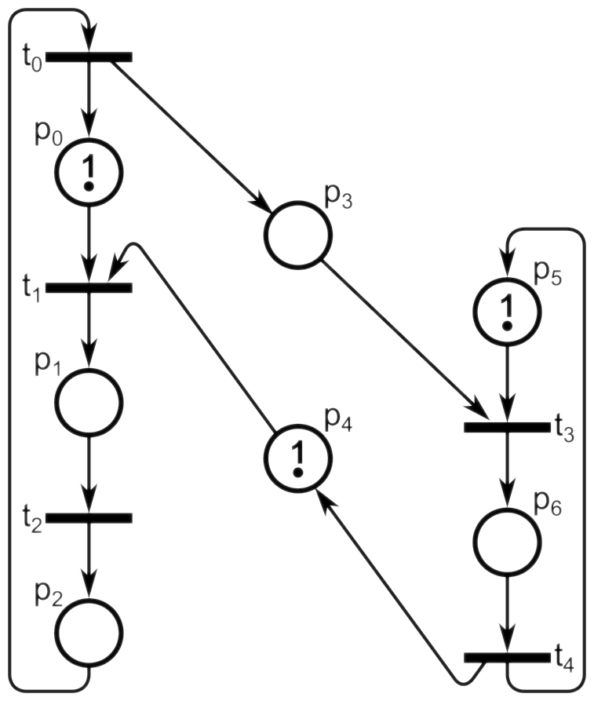
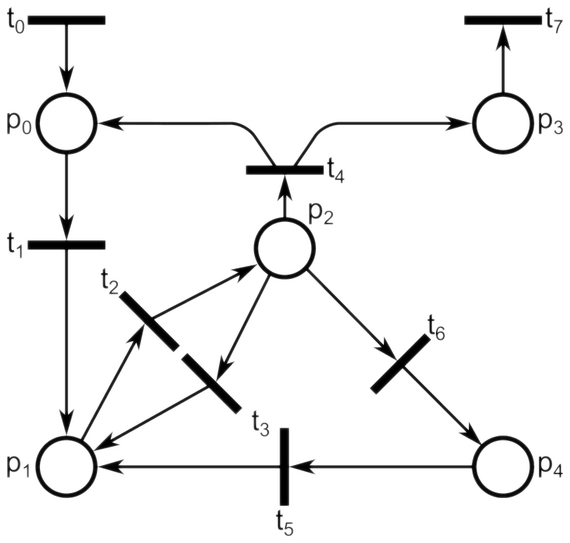

# Modelowanie i Analiza Systemów Informatycznych

## Sprawozdanie z laboratorium

Data | Tytuł zajęć | Uczestnicy
:-: | :-: | :-:
02.04.2020 15:15 |  Sieci Petriego - konstrukcja i analiza behawioralna sieci Petriego | Bartosz Rodziewicz (226105)

### Zadanie 1

```
Wykonaj formalny opis tej sieci Petriego.
```



#### Formalny opis sieci Petriego:

SP = <P,T,F,H,W,C,M<sub>0</sub>>, gdzie:
* P = {p<sub>0</sub>, p<sub>1</sub>, p<sub>2</sub>, p<sub>3</sub>, p<sub>4</sub>, p<sub>5</sub>, p<sub>6</sub>}
* T = {t<sub>0</sub>, t<sub>1</sub>, t<sub>2</sub>, t<sub>3</sub>, t<sub>4</sub>}
* F = {{p<sub>0</sub>, t<sub>1</sub>}, {t<sub>1</sub>, p<sub>1</sub>}, {p<sub>1</sub>, t<sub>2</sub>}, {t<sub>2</sub>, p<sub>2</sub>}, {p<sub>2</sub>, t<sub>0</sub>}, {t<sub>0</sub>, p<sub>0</sub>}, {t<sub>0</sub>, p<sub>3</sub>}, {p<sub>3</sub>, t<sub>3</sub>}, {t<sub>3</sub>, p<sub>6</sub>}, {p<sub>6</sub>, t<sub>4</sub>}, {t<sub>4</sub>, p<sub>5</sub>}, {p<sub>5</sub>, t<sub>3</sub>}, {t<sub>4</sub>, p<sub>4</sub>}, {p<sub>4</sub>, t<sub>1</sub>}}
* H = ∅
* W = {1, 1, 1, 1, 1, 1, 1, 1, 1, 1, 1, 1, 1, 1}
* C = {∞, ∞, ∞, ∞, ∞, ∞, ∞}
* M<sub>0</sub> = {1, 0, 0, 0, 1, 1, 0}

### Zadanie 2

```
Wykonaj graf osiągalności dla sieci Petriego z pierwszego zadania.
```


### Zadanie 3

```
Na podstawie symulacji sieci Petriego z pierwszego zadania i grafu osiągalności z drugiego zadania wykonaj analizę behawioralną tej sieci, aby sprawdzić jej:
– ograniczoność,
– bezpieczeństwo,
– zachowawczość,
– żywotność.
Uzasadnij każdą odpowiedź.
```

#### Ograniczoność
Patrząc na graf osiągalności widzimy, że liczba znaczników nigdy nie przekracza 3, więc ta sieć jest 3-ograniczona.

#### Bezpieczeństwo
Aby sieć była bezpieczna musi być 1-ograniczona. Ta sieć jest 3-ograniczona, więc nie jest bezpieczna.

### Zachowawczość
W sieci istnieją stany z dwoma i trzema znacznikami. Nie jest więc to sieć zachowawcza, ponieważ liczba znaczników ulega zmianie, podczas przechodzenia pomiędzy różnymi stanami.

#### Żywotność
Patrząc na graf osiągalności widzimy, że znajduje się w nim każde przejście, oraz że sieć działa w pętli. Oznacza to więc, że w każdym stanie sieci można odpalić jedno przejście i każde przejście może być kiedyś odpalone, czyli sieć jest żywotna.

### Zadanie 4

```
Ogranicz liczbę znaczników w miejscu p2 do 1 w tej sieci Petriego, bez zmiany reszty zachowania sieci.
```



Treść polecenia nie mówi nic o braku możliwości skorzystania z łuku hamującego. Moje rozwiązanie polega, więc na dodaniu łuku hamującego {p<sub>2</sub>, t<sub>2</sub>} o wadze 1.


