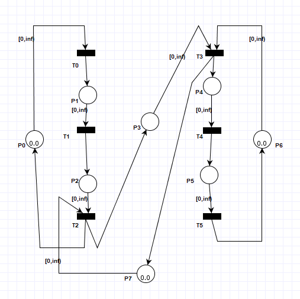
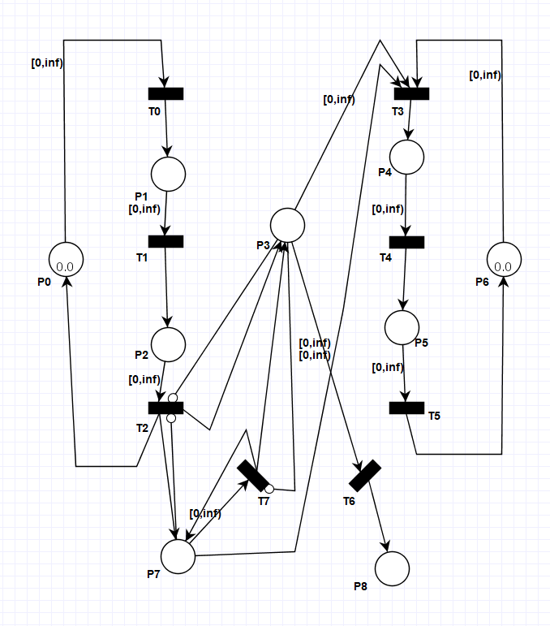

# Modelowanie i Analiza Systemów Informatycznych

## Sprawozdanie z laboratorium

Data | Tytuł zajęć | Uczestnicy
:-: | :-: | :-:
16.04.2020 15:15 | Sieci Petriego - konstrukcja sieci Petriego z łukami hamującymi (cz. 1) | Bartosz Rodziewicz (226105)

### Zadanie 1

```
Ta sieć Petriego modeluje historię wiadomości przesyłanych między dwoma użytkownikami. Każdy znacznik oznacza wiadomość, a jego położenie oznacza:
- p0 - wiadomość jest u nadawcy w pamięci,
- p1 - wiadomość jest u nadawcy w niezaszyfrowanym pliku,
- p2 - wiadomość jest u nadawcy w zaszyfrowanym pliku,
- p3 - wiadomość jest w drodze od nadawcy do odbiorcy,
- p4 - wiadomość jest u odbiorcy w zaszyfrowanym pliku,
- p5 - wiadomość jest u odbiorcy w niezaszyfrowanym pliku,
- p6 - wiadomość jest u odbiorcy w pamięci.

Rozbuduj tę sieć, tak aby naraz najwyżej jedna wiadomość mogła być w drodze od nadawcy do odbiorcy.
```

Rozwiązaniem jest dodanie pola p<sub>7</sub> z jednym znacznikiem w fazie początkowej oraz dwóch łuków {t<sub>3</sub>, p<sub>7</sub>} i {p<sub>7</sub>, t<sub>2</sub>}, obu o wadze 1.



<div class="page-break"></div>

### Zadanie 2

```
Rozbuduj sieć z pierwszego zadania, tak aby naraz najwyżej jedna wiadomość mogła być w drodze od nadawcy do odbiorcy. Tym razem użyj łuku hamującego
```

Rozwiązaniem jest dodanie łuku hamującego {p<sub>3</sub>, t<sub>2</sub>} o wadze 1.


### Zadanie 3

```
Rozbuduj sieć wykonaną w drugim zadaniu o miejsca:
- p7 - zapasowa kopia wiadomości, która jest w drodze od nadawcy do odbiorcy, jest zachowana na wypadek utraty wysłanej wiadomości;
- p8 - wiadomość, która była w drodze od nadawcy do odbiorcy, jest zgubiona - nie dotarła do odbiorcy.
Razem z wysłaniem wiadomości przez nadawcę należy utworzyć jej zapasową kopię, której kopię należy wysłać w każdym przypadku utraty wiadomości będącej w drodze do odbiorcy. Kopia zapasowa musi być usunięta kiedy (i tylko wtedy, gdy) odbiorca otrzymuje wiadomość.
Nadawca nie może wysłać następnej wiadomości, zanim poprzednia nie dotrze do odbiorcy.
```

Rozwiązanie widoczne jest na schemacie poniżej. Pole p<sub>7</sub> otrzymuje w momencie wysłania kopię wiadomości za pomocą łuku {t<sub>2</sub>, p<sub>7</sub>}. Łuk hamujący {p<sub>7</sub>, t<sub>2</sub>} zapobiega wysłaniu wiadomości, gdy istnieje kopia poprzedniej wiadomości (wysyłka nie zakończona sukcesem). Łuk {p<sub>7</sub>, t<sub>3</sub>} powoduje usunięcie kopii poprzedniej wiadomości, po poprawnej wysyłce. Przejście t<sub>6</sub> służy do wywołania błędu transmisji. Wszystkie niedostarczone wiadomości przechowywane są w p<sub>8</sub>. Łuk hamujący {p<sub>3</sub>, t<sub>7</sub>} zapobiega możliwości "ponownej wysyłki", dopóki wiadomość nie została zgubiona (lub teoretycznie dostarczona, natomiast wtedy, nie będzie już istniała kopia wiadomości do ponownej wysyłki).

Pomyślałem jeszcze o drugim lekko innym rozwiązaniu do tego zadania polegającemu na łuku {p<sub>8</sub>, t<sub>7</sub>} (nie ma go na schemacie) zamiast łuku hamującego {p<sub>3</sub>, t<sub>7</sub>}. W tym rozwiązaniu pole p<sub>8</sub> nie przechowuje wszystkich zgubionych wiadomości, a tylko ostatnie, do momentu ponownej retransmisji. Czytając polecenie nie jestem w stanie zdecydować, które z nich bardziej pasuje do treści, dlatego wspominam o obu.

Wagi wszystkich wspomnianych i dodanych na schemacie łuków wynoszą 1.


