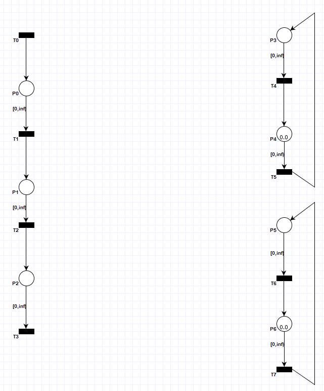
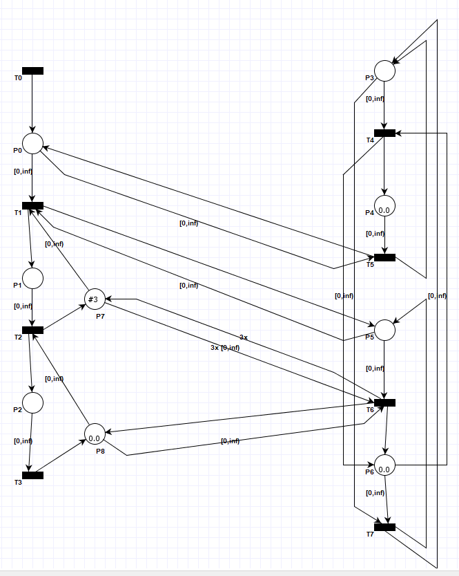
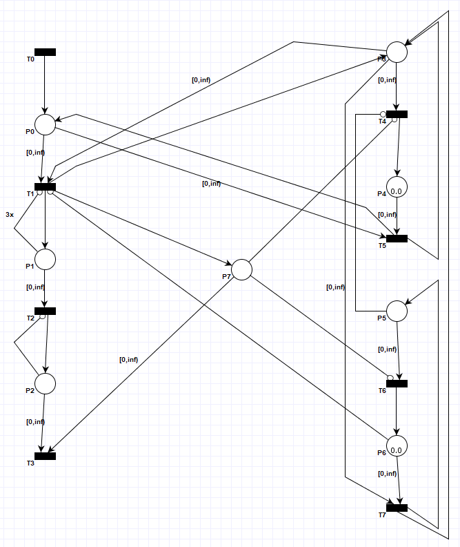

# Modelowanie i Analiza Systemów Informatycznych

## Sprawozdanie z laboratorium

Data | Tytuł zajęć | Uczestnicy
:-: | :-: | :-:
23.04.2020 15:15 | Sieci Petriego - konstrukcja sieci Petriego z łukami hamującymi (cz. 2) | Bartosz Rodziewicz (226105)

### Zadanie 1

```
Te trzy fragmenty sieci Petriego modelują sytuację na przejeździe kolejowym:
– fragment po lewej modeluje położenie pociągu na torach; każdy znacznik oznacza tu jeden pociąg, a jego położenie oznacza:
	– p0 - pociąg jest przed semaforem;
	– p1 - pociąg jest za semaforem, a przed przejazdem;
	– p2 - pociąg jest na przejeździe.
– fragment po prawej u góry modeluje stan szlabanu na przejeździe; położenie znaczniku oznacza:
	– p3 - szlaban jest opuszczony (ruch samochodów nie jest możliwy);
	– p4 - szlaban jest podniesiony (ruch samochodów jest możliwy);
– fragment po prawej u dołu modeluje stan semaforu przed przejazdem; położenie znaczniku oznacza:
	– p5 - semafor świeci się na zielono (wjazd pociągu na przejazd jest możliwy);
	– p6 - semafor świeci się na czerwono (wjazd pociągu na przejazd nie jest możliwy).
```



```
Rozbuduj tę sieć, tak aby wjazd pociągu na odcinek przed semaforem (p0) powodował opuszczenie szlabanu, a następnie zaświecenie semaforu na zielono. Analogicznie, aby wyjazd pociągu z przejazdu (p2) powodował zaświecenie semaforu na czerwono, a następnie podniesienie szlabanu, o ile nie ma więcej pociągów za semaforem (p1) lub na przejeździe (p2). Przed przejazdem (p1) może przebywać jednocześnie najwyżej 3 pociągi, a na przejeździe (p2) najwyżej jeden pociąg.
```

<div class="page-break"></div>

Rozwiązanie uniemożliwia pociągowi wjazd za semafor dopóki szlabany nie zostaną opuszczone i światło zielone się nie zapali. Zapalenie światła zielonego jest możliwe dopiero po opuszczeniu rogatek, natomiast podniesienie rogatek wtedy gdy świeci się światło czerwone. Dodatkowo, aby zapalić zielone światło zapory muszą być opuszczone i musi oczekiwać co najmniej jeden pociąg na przejazd. Światło można z powrotem zmienić na czerwone i otworzyć szlaban jeśli pociąg nie zdecyduje się na wjazd. Wg mnie powinno jeszcze zostać dodana możliwość zmiany światła na czerwone, gdy pociąg już przejechał sygnalizator, natomiast podniesienie szlabanów powinno nadal być zablokowane (sytuacja występująca w rzeczywistości), jednak nie jest to napisane w instrukcji, dlatego nie zostało wykonane. Do wykonania zadania konieczna była zmiana wagi dwóch krawędzi.



<div class="page-break"></div>

### Zadanie 2

Zadanie, jest dokładną kopią w kwestii działania rozwiązania z zadania pierwszego, natomiast wszędzie, gdzie to możliwe zostały wstawione łuki hamujące. Do wykonania zadania konieczna była zmiana wagi jednej krawędzi.

```
Przebuduj sieć wykonaną w pierwszym zadaniu, tak aby ograniczyć liczbę pociągów przed przejazdem (p1) i na przejeździe (p2) przy pomocy łuków hamujących.
```


