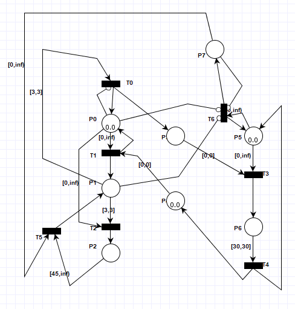

# Modelowanie i Analiza Systemów Informatycznych

## Sprawozdanie z laboratorium

Data | Tytuł zajęć | Uczestnicy
:-: | :-: | :-:
30.04.2020 15:15 | Sieci Petriego - konstrukcja sieci Petriego z łukami czasowymi | Bartosz Rodziewicz (226105)

### Zadanie 1

```
Ta sieć Petriego modeluje pory roku. Łuki wchodzące do przejść są czasowe i definiują czas trwania pór roku. Położenie znaczniku oznacza trwającą porę: p0 - lato, p1 - jesień, p2 - zimę i p3 - wiosnę.
```


```
Rozbuduj tą sieć, tak aby zima trwała jeden dzień dłużej raz na cztery lata (tzw. rok przestępny). Użyj łuki hamujące i różne wagi łuków.
```

Rozwiązaniem tego zadania jest dodanie pola, które "zlicza" ilość lat pomiędzy latami przestępnymi i gdy miną 4 dezaktywuje zwykłe przejście aktywując przejście przestępne (różnica w wartości czasowej). Sieć nie uwzględnia braku występowania roku przestępnego w pełnych stuleciach nie podzielnych przez 400 (jak lata 1900, czy 2100), jednak nie było o tym w treści zadania.


<div class="page-break"></div>

### Zadanie 2

```
Ta sieć Petriego modeluje sygnalizację świetlną na przejściu dla pieszych: sygnalizator dla pojazdów (lewa część sieci) i sygnalizator dla pieszych (prawa część sieci). Położenie znacznika oznacza:
– p0 - sygnalizator dla pojazdów świeci się na czerwono,
– p1 - sygnalizator dla pojazdów świeci się na żółto,
– p2 - sygnalizator dla pojazdów świeci się na zielono,
– p5 - sygnalizator dla pieszych świeci się na czerwono,
– p6 - sygnalizator dla pieszych świeci się na zielono.
```


```
Przebuduj tą sieć, tak aby:
– kolejność świateł sygnalizatora dla pojazdów była następująca: czerwone, czerwone+żółte, zielone, żółte, itd.;
– żółte światło (z i bez czerwonego) dla pojazdów świeciło się 3s;
– zielone światło dla pojazdów świeciło się 45s;
– zielone światło dla pieszych świeciło się 30s.
```

Sieć z zadania posiada kolejność świateł dla samochodów (lewa strona) następującą: czerwony, żółty, zielony, czerwony, itd. Z uwagi na zmianę kolejności na odpowiadającą rzeczywistej konieczne jest skomplikowanie przejść po lewej stronie. Dodatkowo trzeba w nich uwzględnić odpowiednie wartości wartkości czasowych.


### Zadanie 3

```
Rozbuduj sieć Petriego wykonaną w drugim zadaniu o miejsce, w którym obecność znacznika oznacza naciśnięcie przycisku przez pieszego w celu przejścia przez jezdnię.
Przebuduj tą sieć, tak aby sygnalizator dla pieszych zapalał zielone światło, a sygnalizator dla pojazdów zapalał czerwone światło tylko w reakcji na naciśnięcie tego przycisku; a zielone światło dla pojazdów świeciło się minimum 45s.
```

Kluczowym aspektem do modyfikacji rozwiązania poprzedniego zadania (poza dodaniem pola i przejść obsługujących przycisk) jest zmiana wartości czasowej łuku (P2, T5) z [45, 45], na [45, inf). Powoduje to, że światło dla samochodów świeci się conajmniej 45s, a nie dokładnie 45s.


