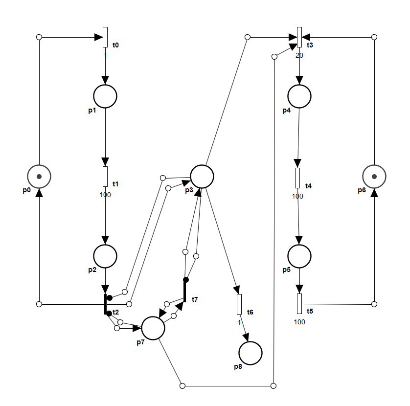
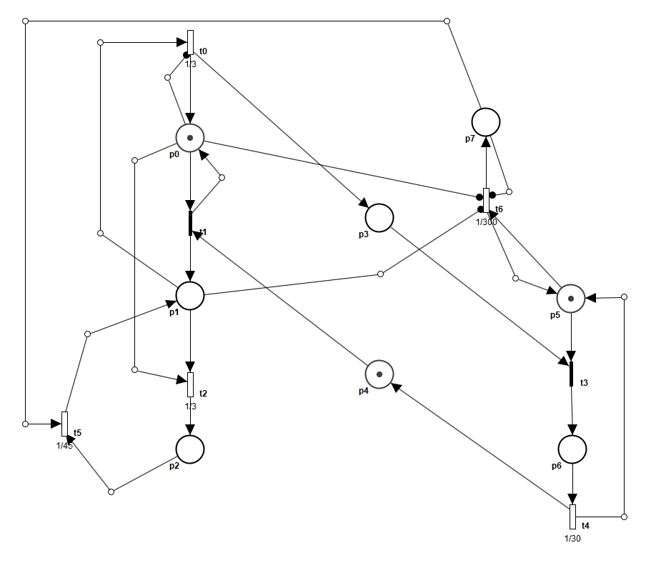

# Modelowanie i Analiza Systemów Informatycznych

## Sprawozdanie z laboratorium

Data | Tytuł zajęć | Uczestnicy
:-: | :-: | :-:
07.05.2020 15:15 | Sieci Petriego - konstrukcja uogólnionych stochastycznych sieci Petriego. | Bartosz Rodziewicz (226105)

### Zadanie 1

```
Na 1. laboratorium z sieci Petriego z łukami hamującymi, w zadaniu 3, została utworzona sieć modelująca historie wiadomości przesyłanych między dwoma użytkownikami, gdzie wiadomość mogła się zgubić.
Zamień przejścia tej sieci, którą utworzyłeś, na natychmiastowe i czasowe przejścia z realistycznymi wykładniczymi zmiennymi losowymi. Jeśli jedno z dwóch dostępnych przejść powinno być odpalone wcześniej, uczyń jego odpalenie bardziej prawdopodobnym.
```

Wydaje mi się, że jako, że ta sieć moduluje pewien rzeczywisty proces, to możemy założyć, że praktycznie każde przejście jest przejściem czasowym, ponieważ wykonanie działania pomiędzy dwoma stanami zajmuje trochę czasu. Starałem się jednak przedstawić sytuację na schemacie jak najbardziej bliską rzeczywistości. Chciałbym, też zaznaczyć, że wartości parametru λ nie przekładają się bezpośrednio na sekundy, a jedynie chciałem nimi pokazać względne zależności (nie chodziło mi o to, że transmisja wiadomości trwa 1/20s).

Zgubienie wiadomości, jak i samo pobudzenie sieci poprzez wysłanie wiadomości uznałem, że są stosunkowo rzadkimi zjawiskami dlatego przejścia t0 oraz t6 mają λ=1. Procesy lokalne, takie jak szyfrowanie, deszyfrowanie, czy zapis wiadomości do pamięci są bardzo szybkie dlatego przejścia t1, t4 i t5 mają λ=100. Transmisja pomiędzy urządzeniami jest wolniejsza dlatego t3 ma λ=20. Przejścia t2 i t7 są przejściami natychmiastowymi, ponieważ samo rozpoczęcie transmisji praktycznie nie zajmuje czasu.



<div class="page-break"></div>

### Zadanie 2

```
Na laboratorium z sieci Petriego z łukami czasowymi, w zadaniu 3, została utworzona sieć modelująca światła uliczne na przejściu dla pieszych, gdzie pieszy naciskał przycisk, aby przejść przez jezdnię.
Zamień przejścia tej sieci, którą utworzyłeś, na natychmiastowe i czasowe przejścia z realistycznymi wykładniczymi zmiennymi losowymi. Jeśli jedno z dwóch dostępnych przejść powinno być odpalone wcześniej, uczyń jego odpalenie bardziej prawdopodobnym.
```

W tym zadaniu starałem się odwzorować, aby wartości λ bezpośrednio przeliczały się na sekundy.

Sytuacja, że piesi i samochody mają czerwone światło nie powinna mieć miejsca dlatego przejście t1 jest przejściem natychmiastowym. Powoduje ono zaświecenie czerwonego i pomarańczowego dla samochodów. Przejście t2, które zmienia to na światło zielone ma λ=1/3, ponieważ czerwone+pomarańczowe powinno się świecić przez 3s. Główną niewiadomą dla mnie w tym zadaniu było wybranie czasu dla pieszego. Założyłem, że jest to sygnalizacja świetlna na mało uczęszczanym przez pieszych przejściu i ustawiłem λ przejścia t6 na 1/300, zakładając, że średnio pieszy na przejściu pojawia się co 5 min. Problemem, który napotkałem jest przejście t5. Ustawiając λ tego przejścia na 1/45 powoduje, że średni czas oczekiwania pieszego po kliknięciu przycisku wynosi 45s, a nie tak jak było w oryginalnej sieci, że to 45s liczy się od zapalenia się zielonego dla samochodów. Nie wiedziałem jednak, jak w takiej sieci inaczej uwzględnić tą regułę. Inne przejścia są ustawione tak by bezpośrednio oddawać czasy trwania poszczególnych świateł i tak:
* t0 ma λ=1/3, ponieważ pomarańczowe dla samochodów powinno świecić się 3s,
* t3 jest przejściem natychmiastowym, ponieważ po zapaleniu się czerwnonego dla samochodów piesi mogą natychmiast dostać zielone światło (w rzeczywistości tutaj też powinien być jakiś czas zabezpieczenia, natomiast zadanie w formie sieci z łukami czasowymi go nie uwzględniało),
* t4 ma λ=1/30, ponieważ zielone światło dla pieszych powinno świecić się 30s.


