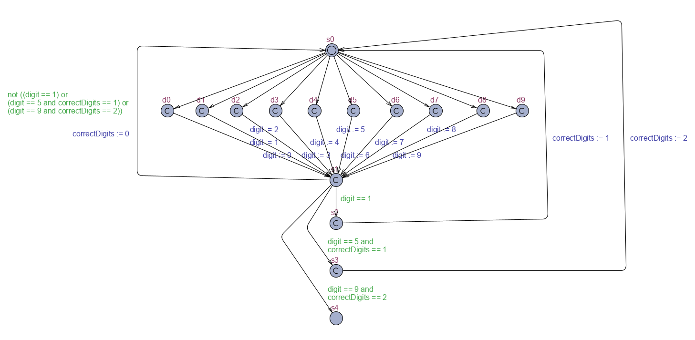

# Modelowanie i Analiza Systemów Informatycznych

## Sprawozdanie z laboratorium

Data | Tytuł zajęć | Uczestnicy
:-: | :-: | :-:
14.05.2020 15:15 |  Logika temporalna i automaty czasowe - konstrukcja prostych automatów UPPAAL. | Bartosz Rodziewicz (226105)

### Zadanie 1

```
Otwórz UPPAAL 4.0: Small Tutorial i wykonaj polecenia z rozdziału 3.2 od słów „In order to create a template…” na dole str. 5. Będzie to budowa szablonu (ang. template) automatu, który będzie miał dwie instancje (rys. ?), następnie jego symulacja i weryfikacja.
```

Zadanie zostało wykonane podążając zgodnie z tutorialem.

#### Template mutex

Name: `mutex`  
Parameters: `const int[1,2] me, int[0,1] &req_self, int[0,1] &req_other`


#### Global declarations
```
int[0,1] req1,req2;
int[1,2] turn;
```

#### System declarations

```
P1 = mutex(1, req1, req2);
P2 = mutex(2, req2, req1);

system P1, P2;
```

### Zadanie 2

```
Wykonaj automat zamka szyfrowego, który przyjmuje dowolnej długości ciąg cyfr z zakresu od 0 do 9. Ciąg cyfr, kończący się sekwencją 159, otwiera zamek. Otwarcie zamka powoduje zatrzymanie działania automatu (ang. deadlock).
```

Rozwiązaniem tego zadania jest poniższy schemat. Każdy stan poza s0 (start) i s4 (deadlock) jest stanem typu committed, ponieważ po wybraniu cyfry (wybór przejścia ze stanu s0 do stanów d0-d9) automat powinien momentalnie przejść do stanu początkowego (aby umożliwić kolejny wybór), bądź do stanu d4, aby zamek się otworzył. Pozwoliłem sobie zmienić zmienną `cyfra` na `digit`, ponieważ polska nazwa zmiennej mi nie pasowała. W deklaracji zmiennej `correctDigits` (reprezentującej ile poprawnych cyfr kodu zostało wpisanych do tej pory) zmienna ta ma przypisywaną wartość 0, ponieważ jej pierwsze użycie następuje szybciej niż przypisanie wartości na schemacie. Zmienna `digit` nie ma przypisywanej wartości w deklaracji, ponieważ używana jest dopiero po przypisaniu przez automat. W rozwiązaniu można by nie wprowadzać zmiennej `correctDigits` natomiast wtedy 10 stanów do wybierania poprawnej liczby musiałoby powtórzyć się 4 razy.

#### Template Locker



#### Local Locker declarations
```
int [0,9] digit;
int [0,2] correctDigits = 0;
```

#### System declarations

```
system Locker;
```

### Zadanie 3

```
Wykonaj automat losowo generujący cyfry z zakresu od 0 do 9.
```

Rozwiązaniem zadania jest schemat widoczny poniżej. Zmienna `digit` w deklaracji ma przypisywaną wartość, aby generator jeszcze przed pierwszym uruchomieniem zwracał poprawną wartość z przedziału. Zmienna jest zadeklarowana jako globalna, ponieważ jedyne jej zastosowanie jest, aby inny automat odnosił się do jej wartości (generator jedynie przypisuje jej wartość, nigdy jej nie używa).

#### Template Generator


#### Global declarations
```
int [0,9] digit = 0;
```

#### System declarations

```
system Generator;
```

### Zadanie 4

```
Wykonaj jak najmniejszy automat losowo generujący cyfry z zakresu od 0 do 9.
```

Tak jak powyżej, tylko 10 przejść jest zamienionych na jedno, wykonujące operacje select w trakcie.

#### Template Generator


#### Global declarations
```
int [0,9] digit = 0;
```

#### System declarations

```
system Generator;
```

### Zadanie 5

```
Wykonaj jak najmniejszy automat zamka szyfrowego, który przyjmuje dowolnej długości ciąg cyfr z zakresu od 0 do 9. Cyfry generowane są przez automat opracowany w zadaniu 3 lub 4, poprawiony do tego zadania. Ciąg cyfr, kończący się sekwencją 159, otwiera zamek. Otwarcie zamka powoduje zatrzymanie działania automatu (ang. deadlock).
```

Generator użyty w tym zadaniu to ten, który stworzyłem w zad. 4, dodając do niego obsługę zmiennej synchronizacyjnej o nazwie `synchronizer`. Najprostszy zamek natomiast to uproszczona wersja zamka z zadania 1. Rozwiązanie, tak jak w zad. 1, wykorzystują lokalną zmienną pomocniczą `correctDigits`, dzięki czemu zminimalizowana jest ilość stanów do minimum. Rozwiązanie to, posiada taką wadę, że w trakcie symulacji wykonywany jest tak jakby jeden ruch do przodu, niż przejście, które jest wybierane, ponieważ automat wykorzystuje poprzednio wylosowaną wartość zmiennej `digit`. Z tego też powodu konieczne jest przypisanie jakiejś startowej wartości do zmiennej `digit` (jej wartość zostaje szybciej odczytana niż zapisana ta wylosowana).

#### Template Generator


#### Template Locker


#### Local Locker declarations
```
int [0,2] correctDigits = 0;
```

#### Global declarations
```
int [0,9] digit = 0;
chan synchronizer;
```

#### System declarations

```
system Generator, Locker;
```
