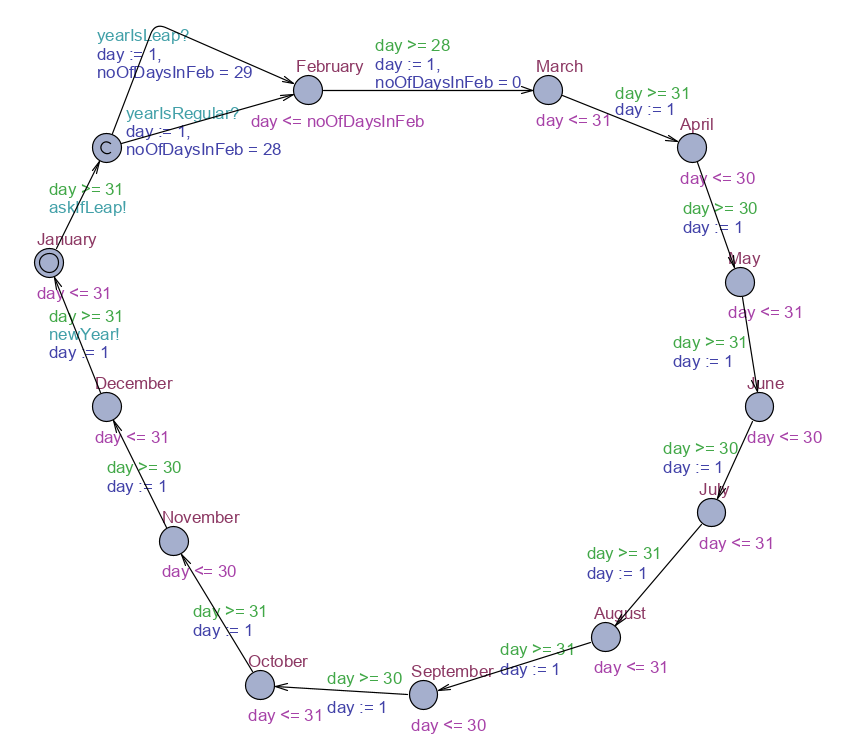
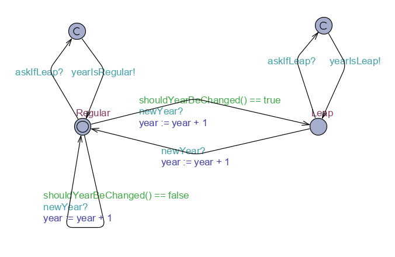
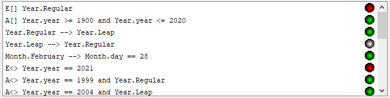
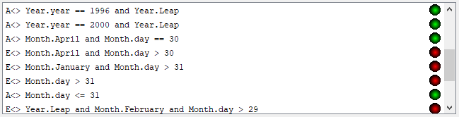
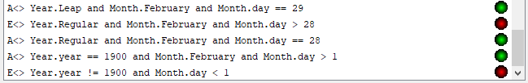

# Modelowanie i Analiza Systemów Informatycznych

## Sprawozdanie z laboratorium

Data | Tytuł zajęć | Uczestnicy
:-: | :-: | :-:
21.05.2020 15:15 | Logika Temporalna i Automaty Czasowe - konstrukcja i weryfikacja zsynchronizowanych czasowych automatów UPPAAL (cz. 1). | Bartosz Rodziewicz (226105)

### Zadanie 1

```
Wykonaj układ dwóch automatów, modelujących kalendarz, zsynchronizowanych ze sobą kanałami typu chan lub urgent chan.
Automat Miesiąc wyznacza bieżący miesiąc:
– bieżący miesiąc wskazywany jest przez stan automatu (Styczeń, Luty, ...);
– bieżący dzień wskazywany jest przez zmienną dzień typu clock;
– zmiana miesiąca jest spowodowana przekroczeniem jego liczby dni.
Automat Rok wyznacza bieżący rok:
– typ bieżącego roku wskazywany jest przez stan automatu (Normalny, Przestępny);
– numer bieżącego roku wskazywany jest przez zmienną rok typu int o zakresie od 1900 do 2020;
– zmiana numeru roku jest spowodowana przez automat Miesiąc;
– zmiana typu roku jest spowodowana przez funkcję zmiana typu bool.
Synchronizacja między automatami:
– automat Miesiąc powoduje bezczasową (natychmiastową) synchronizację z automatem Rok podczas zmiany miesiąca z grudnia na styczeń, aby spowodował inkrementację roku i ewentualne ustawienie jego normalności lub przestępności;
– automat Miesiąc powoduje bezczasową (natychmiastową) synchronizację z automatem Rok podczas zmiany miesiąca ze stycznia na luty, aby sprawdzić, czy luty ma trwać jeden dzień dłużej; w odpowiedzi automat Rok natychmiast powoduje bezczasową (natychmiastową) synchronizację z automatem Miesiąc kanałem odpowiednim do rodzaju roku.
```

Zadanie zostało wykonane zgodnie z poleceniem. Zamieniłem jednak wszystkie polskie nazwy na angielskie, aby nie było problemu z polskimi znakami i aby wyglądało to lepiej (zwłaszcza nazwy zmiennych). Do przejścia pomiędzy styczniem, a lutym w automacie Miesiąc, został dodany jeden stan typu committed, po wejściu do którego automat od razu z niego wychodzi. Jest on po to by wykonać wymagane zapytanie do automatu Rok i otrzymać z niego odpowiedź. Synchronizacja od Miesiąca do Roku jest realizowana dwoma zmiennymi typu `chan` z uwagi na obecność czasowych guardów na przejściach grudzień->styczeń i styczeń->dodatkowyStan. Synchronizacja z automatu Rok do Miesiąc jest `urgent chan`, ponieważ ten dodatkowy stan nie ma żadnych czasowych ograniczeń. Dzięki zastosowaniu zmiennej przypisującej długość miesiąca luty, przed wejściem do stanu luty, możliwe jest posiadanie jednego stanu reprezentującego ten miesiąc. Zmienna przechowująca długość dni lutego jest zaraz po opuszczeniu lutego zerowana, aby przypadkiem informacja z poprzedniego roku nie pozostała w automacie Miesiąc. Dodatkowo sprawdzone w kolejnym zadaniu jest czy żaden miesiąc nie ma dnia zerowego (z wyjątkiem stycznia roku 1900, w którym automat startuje (z uwagi na auto inicjalizację zmiennej `clock` na 0)).

#### Template Month



#### Local Month declarations
```
clock day;
int [0,29] noOfDaysInFeb = 0;
```

#### Template Year



#### Local Year declarations
```
int [1900, 2020] year = 1900;

bool shouldYearBeChanged() {
	if (((year + 1) % 100 != 0 and (year + 1) % 4 == 0) or ((year + 1) % 400 == 0)) {
		return true;
	}
	return false;
}
```

#### Global declarations
```
chan newYear;
chan askIfLeap;
urgent chan yearIsRegular;
urgent chan yearIsLeap;
```

#### System declarations
```
system Month, Year;
```

### Zadanie 2

```
Zweryfikuj poprawność działania modelu wykonanego w zadaniu 1. Do każdej weryfikowanej formuły podaj: jej postać w języku UPPAAL, jej słowny opis i wynik jej weryfikacji.
W szczególności zweryfikuj, czy każdy miesiąc trwa dokładnie tyle dni, ile powinien, i czy liczba dni w lutym zależy od typu roku.
```

Testy były generalnie pisane od tych, które są na samym dole, do tych, które są na górze listy. UPAALL nie pozwala dodać nowego testu na końcu, tylko zawsze dodaje przed zaznaczonym, dlatego lista tutaj i na screenach jest w przeciwnej kolejności względem pisania.

#### Napisane testy

1.	Kod: `E[] Year.Regular`  
	Opis: Czy istnieje taka ścieżka, że każdy rok jest zwykły?  
	Weryfikacja: **NIE**

1.	Kod: `A[] Year.year >= 1900 and Year.year <= 2020`  
	Opis: Czy dla każdej ścieżki zawsze rok jest pomiędzy 1900, a 2020?  
	Weryfikacja: **TAK**

1.	Kod: `Year.Regular --> Year.Leap`  
	Opis: Czy po każdym roku zwykłym kiedyś następuje przestępny?  
	Weryfikacja: **TAK**

1.	Kod: `Year.Leap --> Year.Regular`  
	Opis: Czy po każdym roku przestępnym kiedyś następuje zwykły?  
	Weryfikacja: **NIE**  
	Wyjaśnienie: Nie, ponieważ 2020, który jest ostatnim rokiem w tym kalendarzu jest rokiem przestępnym i po nim nie następuje żaden rok. Nie ma też żadnej blokady w stanie grudzień, co skutkuje błędem w grudniu roku 2020. Nie było w poleceniu nic o konieczności odpowiedniego zabezpieczenia tego roku, więc założyłem, że taka nieścisłość może pozostać.

1.	Kod: `Month.February --> Month.day == 28`  
	Opis: Czy po osiągnięciu lutego, wystąpi miesiąc, który ma co najmniej 28 dni?  
	Weryfikacja: **TAK**

1.	Kod: `E<> Year.year == 2021`  
	Opis: Czy istnieje taka ścieżka, że kiedyś będzie 2021 rok?  
	Weryfikacja: **NIE**

1.	Kod: `A<> Year.year == 1999 and Year.Regular`  
	Opis: Czy dla każdej ścieżki rok 1999 jest rokiem zwykłym?  
	Weryfikacja: **TAK**

1.	Kod: `A<> Year.year == 2004 and Year.Leap`  
	Opis: Czy dla każdej ścieżki rok 2004 jest rokiem przestępnym?  
	Weryfikacja: **TAK**

1.	Kod: `A<> Year.year == 1996 and Year.Leap`  
	Opis: Czy dla każdej ścieżki rok 1996 jest rokiem przestępnym?  
	Weryfikacja: **TAK**

1.	Kod: `A<> Year.year == 2000 and Year.Leap`  
	Opis: Czy dla każdej ścieżki rok 2000 jest rokiem przestępnym?  
	Weryfikacja: **TAK**

1.	Kod: `A<> Month.April and Month.day == 30`  
	Opis: Czy dla każdej ścieżki istnieje Kwiecień, który ma 30 dni?  
	Weryfikacja: **TAK**

1.	Kod: `E<> Month.April and Month.day > 30`  
	Opis: Czy istnieje ścieżka w której kiedyś któryś Kwiecień ma więcej niż 30 dni?  
	Weryfikacja: **NIE**

1.	Kod: `E<> Month.January and Month.day > 31`  
	Opis: Czy istnieje ścieżka w której kiedyś któryś Styczeń ma więcej niż 31 dni?  
	Weryfikacja: **NIE**

1.	Kod: `E<> Month.day > 31`  
	Opis: Czy istnieje ścieżka, w której jakikolwiek miesiąc, który ma więcej niż 31 dni?  
	Weryfikacja: **NIE**

1.	Kod: `A<> Month.day <= 31`  
	Opis: Czy w każdej ścieżce istnieje miesiąc, który ma 31 dni lub mniej?  
	Weryfikacja: **TAK**

1.	Kod: `E<> Year.Leap and Month.February and Month.day > 29`  
	Opis: Czy istnieje ścieżka w której istnieje jakikolwiek rok przestępny mający więcej niż 29 dni w lutym?  
	Weryfikacja: **NIE**

1.	Kod: `A<> Year.Leap and Month.February and Month.day == 29`  
	Opis: Czy dla każdej ścieżki istnieje rok przestępny mający 29 dni w lutym?  
	Weryfikacja: **TAK**

1.	Kod: `E<> Year.Regular and Month.February and Month.day > 28`  
	Opis: Czy istnieje ścieżka w której istnieje jakikolwiek rok normalny mający więcej niż 28 dni w lutym?  
	Weryfikacja: **NIE**

1.	Kod: `A<> Year.Regular and Month.February and Month.day == 28`  
	Opis: Czy dla każdej ścieżki istnieje rok normalny mający 28 dni w lutym?  
	Weryfikacja: **TAK**

1.	Kod: `A<> Year.year == 1900 and Month.February and Month.day > 1`  
	Opis: Czy dla każdej ścieżki luty w 1900 ma więcej niż jeden dzień?  
	Weryfikacja: **TAK**

1.	Kod: `E<> Year.year != 1900 and Month.day < 1`  
	Opis: Czy istnieje ścieżka, w której miesiąc ma zerowy dzień poza rokiem 1900?  
	Weryfikacja: **NIE**  
	Wyjaśnienie: W roku 1900 miesiąc styczeń ma dzień zerowy, ponieważ automat startuje ze zmienną zegarową ustawioną na 0, podczas gdy każde kolejne przejście "zeruje" tą zmienną na wartość 1. Dzięki temu przedział w dni w każdym miesiącu zaczyna się od 1, a nie od 0, i automat jest czytelniejszy z tego powodu. Aby wykonać go całkowicie poprawnie przedział zmiennej czasowej w każdym miesiącu powinien być [0, ilośćDni-1], a nie [1, ilośćDni]. Zdecydowałem się zostawić ten jeden mały błąd z uwagi na łatwiejszą czytelność schematu.

#### Weryfikacja w programie UPPAAL




