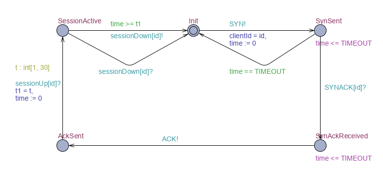
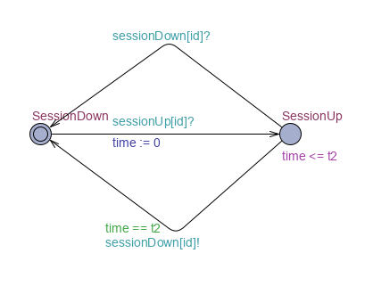
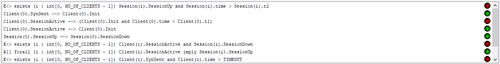
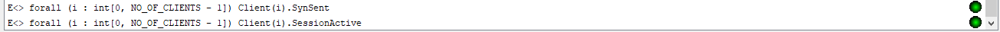

# Modelowanie i Analiza Systemów Informatycznych

## Sprawozdanie z laboratorium

Data | Tytuł zajęć | Uczestnicy
:-: | :-: | :-:
28.05.2020 15:15 | Logika Temporalna i Automaty Czasowe - konstrukcja i weryfikacja zsynchronizowanych czasowych automatów UPPAAL (cz. 2). | Bartosz Rodziewicz (226105)

### Zadanie 1

```
Wykonaj układ automatów modelujących system komunikacji typu klient-serwer z pewną liczbą klientów, mogących łączyć się z serwerem: Automat Serwer ma jedną instancję; służy do nawiązania połączenia z nim przez Klienta i powiązania go z jego Sesją. Automat Klient ma stałą, określoną w parametrze szablonu liczbę instancji. Automat Sesja ma liczbę instancji równą liczbie Klientów, określoną w parametrze szablonu tak, jak szablon Klient.
Nawiązanie przez Klienta połączenia z Serwerem:
– nawiązanie połączenia jest możliwe tylko wtedy, gdy Serwer jest w stanie gotowości do nawiązania połączenia (może to być stan początkowy)?
– nawiązanie połączenia jest procedurą handshakingu sygnałów, których przesyłanie modelowane jest przez synchronizację kanałami:
	1) Klient wysyła do Serwera sygnał SYN,
	2) Po pewnym czasie Serwer odpowiada mu sygnałem SYNACK (jeśli połączenie ma się udać, co serwer ustala losowo),
	3) Po pewnym czasie Klient wysyła Serwerowi sygnał ACK;
– Klient uznaje, że nie udało się nawiązać połączenia z Serwerem, jeśli czas oczekiwania na sygnał SYNACK przekroczy pewną ustaloną wartość.
Powiązanie Klienta z jego Sesją:
– bezpośrednio po nawiązaniu połączenia Klienta z Serwerem, Serwer uruchamia dla Klienta sesję o numerze tego Klienta, przez jednoczesną synchronizację Serwera z Klientem i jego Sesją, po czym powraca do stanu gotowości;
– Klient i jego Sesja pozostaje w stanie powiązania przez czas od t1 (ustalony losowo przez Klienta w momencie rozpoczęcia powiązania) do t2 (ustalony z góry);
– Klient może zerwać powiązanie z Sesją najwcześniej w momencie t1;
– Sesja zrywa powiązanie z Klientem w momencie t2, jeśli Klient wcześniej go nie zerwał;
– zerwanie powiązania odbywa się przez synchronizację kanałem i powoduje, że Klient i Sesja wracają do początkowego stanu gotowości.
```

Zadanie zostało wykonane zgodnie z poleceniem. Zamieniłem jednak wszystkie polskie nazwy na angielskie, aby nie było problemu z polskimi znakami i aby wyglądało to lepiej (zwłaszcza nazwy zmiennych).

Serwer posiada cztery stany: gotowy do połączenia, otrzymany SYN, wysłany SYNACK, otrzymany ACK. Invariant w stanie SynReceived gwarantuje, że do czasu osiągnięcia timeoutu server musi podjąć decyzję, czy połączenie się uda, czy nie. Następnie cała robota serwera to oczekiwanie na ACKa i postawienie sesji. Sygnał sessionUp do stawiana sesji, poza tym, że jest parametryczny, to jest sygnałem broadcast, ponieważ odebrać muszą go dwa automaty.

Najbardziej skomplikowanym schematem jest Klient. Posiada 5 stanów: stan początkowy, stan wysłania SYNa, stan otrzymania SYNACKa, stan wysłania ACKa i stan nawiązanej sesji. Klient ze stanu początkowego próbuje nawiązać połączenie wysyłając SYN, gdy serwer jest wolny. W stanie SynSent klient czeka na reakcje serwera, jeśli do momentu timeoutu nie dostanie odpowiedzi wraca do stanu początkowego. Jeśli dostanie SYNACKa, to wysyła ACKa i czeka na postawienie sesji. W momencie stawiania sesji klient losuje czas trwania połączenie t1 z zakresu od 1 do 30. Po wejściu do aktywnej sesji zeruje się też licznik. W stanie z aktywną sesją klient przebywa przynajmniej t1 czasu. t1 jest zawsze mniejszy niż t2. Jeśli do czasu t2 nie rozłączy połączenia zrobi to automat sesji. Dlatego, też ze stanu SessionActive są dwie krawędzie na jednym sygnale, gdzie jeden wywołuję Sesję do zakończenia, natomiast drugi oczekuje na wywołanie Sesji.

Automat sesji jest bardzo prosty - dwustanowy. Domyślnie sesja nie jest zestawiona, na żądanie serwera jest ona zestawiana. Tak jak w kliencie, przejście z zestawionej sesji na rozłączoną może nastąpić na żądanie Sesji albo Klienta w zależności od czasu.

#### Template Server


#### Local Server declarations
```
clock time;
```

#### Template Client



#### Client parameters
```
const int[0, NO_OF_CLIENTS-1] id
```

#### Local Client declarations
```
clock time;

int t1;
```

#### Template Session



<div class="page-break"></div>

#### Session parameters
```
const int[0, NO_OF_CLIENTS-1] id
```

#### Local Session declarations
```
clock time;

int t2 = 60; // max time for session to close the connection
```

#### Global declarations
```
const int NO_OF_CLIENTS = 3;
const int TIMEOUT = 4;

chan SYN, SYNACK[NO_OF_CLIENTS], ACK;
broadcast chan sessionUp[NO_OF_CLIENTS];
chan sessionDown[NO_OF_CLIENTS];

int clientId;
```

#### System declarations
```
system Server, Client, Session;
```

### Zadanie 2

```
Zweryfikuj poprawność działania modelu wykonanego w zadaniu 1. Do każdej weryfikowanej formuły podaj: jej postać w języku UPPAAL, jej słowny opis i wynik jej weryfikacji.
W szczególności zweryfikuj, czy czas powiązania Klient-Sesja jest poprawny w stosunku do t1 i t2.
```

#### Napisane testy

1.	Kod: `E<> exists (i : int[0, NO_OF_CLIENTS - 1]) Session(i).SessionUp and Session(i).time > Session(i).t2`  
	Opis: Czy istnieje taka ścieżka, że w którymś momencie któryś automat Sesji jest w stanie aktywnym i czas trwania tej sesji jest większy niż t2?  
	Weryfikacja: **NIE**

1.	Kod: `Client(0).SynSent --> Client(0).Init`  
	Opis: Czy jeśli klient nr 0 osiągnie stan SynSent (SYN do serwera wysłany) to kiedyś osiągnie stan Init (sesja zakończona, ponownie może się łączyć)?  
	Weryfikacja: **TAK**

1.	Kod: `Client(0).SessionActive --> (Client(0).Init and Client(0).time < Client(0).t1)`  
	Opis: Czy klient nr 0 kiedykolwiek po zestawieniu sesji będzie w stanie Init mając czas mneijszy niż t1?  
	Weryfikacja: **NIE**

1.	Kod: `Client(0).SessionActive --> Client(0).Init`  
	Opis: Czy klient nr 0 po zestawieniu sesji, zawsze kiedyś ją rozłączy?  
	Weryfikacja: **TAK**  

1.	Kod: `Session(0).SessionUp --> Session(0).SessionDown`  
	Opis: Czy sesja nr 0 po zestawieniu zawsze kiedyś się rozłączy?  
	Weryfikacja: **TAK**

1.	Kod: `E<> exists (i : int[0, NO_OF_CLIENTS - 1]) Client(i).SessionActive and Session(i).SessionDown`  
	Opis: Czy istnieje taka ścieżka, że kiedyś któryś Klient będzie w stanie z zestawioną sesją, a odpowiadająca mu sesja będzie rozłączona?  
	Weryfikacja: **NIE**

1.	Kod: `A[] forall (i : int[0, NO_OF_CLIENTS - 1]) Client(i).SessionActive imply Session(i).SessionUp`  
	Opis: Czy dla każdej ścieżki dla każdego Klienta w każdej chwili jeśli klient jest w stanie z zestawioną sesją to implikuje to, że odpowiadająca mu sesja jest aktywna?  
	Weryfikacja: **TAK**

1.	Kod: `E<> exists (i : int[0, NO_OF_CLIENTS - 1]) Client(i).SynSent and Client(i).time > TIMEOUT`  
	Opis: Czy istnieje taki moment na dowolnej ścieżce, że któryś Klient będzie w stanie SynSent i z czasem przekraczającym timeout?  
	Weryfikacja: **NIE**

1.	Kod: `E<> forall (i : int[0, NO_OF_CLIENTS - 1]) Client(i).SynSent`  
	Opis: Czy istnieje taka ścieżka, że kiedyś każdy Klient będzie jednocześnie w stanie wysłanego SYN?  
	Weryfikacja: **TAK**  
	Wyjaśnienie: Aby taka sytuacja zaszła, każdy klient musi po kolei wysłać prośbę o połączenie, która serwer zrzuci, zanim któryś z klientów ztimeoutuje.

1.	Kod: `E<> forall (i : int[0, NO_OF_CLIENTS - 1]) Client(i).SessionActive`  
	Opis: Czy istnieje taka ścieżka, że kiedyś każdy Klient będzie jednocześnie w stanie zestawionej sesji?  
	Weryfikacja: **TAK**

#### Weryfikacja w programie UPPAAL



