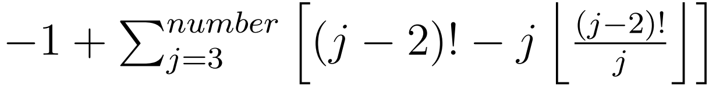

# Modelowanie i Analiza Systemów Informatycznych

## Sprawozdanie z laboratorium

Data | Tytuł zajęć | Uczestnicy
:-: | :-: | :-:
10.06.2020 15:15 | Logika Temporalna i Automaty Czasowe - konstrukcja i weryfikacja automatów NuSMV do analizy programu. | Bartosz Rodziewicz (226105)

### Zadanie 1

```
Liczbę pierwszych liczb, nie większych od zadanej liczby (number > 2), można wyznaczyć wzorem
```

```
Poniższy kod programu implementuje ten wzór.
Wstaw do kodu etykiety operacji, w sposób przedstawiony na wykładzie, i zbuduj odpowiadający mu model NuSMV dla number ∈ [0; 8].
```

Rozwiązaniem jest kod poniższego automatu. Wydaje mi się, że możliwe jest dalsze zmniejszenie liczby stanów, jednak nie było w poleceniu informacji o konieczności wykonania automatu z najmniejszą ilością stanów. Poza zmiennymi zdefiniowanymi w kodzie C++, automat posiada zmienną enum `e`, reprezentująca stan programu (linijkę kodu) oraz zmienną enum `out` reprezentującą wynik, który program zwraca. Zmienna `primes`, mimo iż przyjmuje tylko wartości z przedziału 0 oraz [2, 4] musi w swoim zakresie posiadać liczby -1 oraz 1, ponieważ takie wymaganie narzuca NuSMV (transformacja teoretycznie umożliwia przypisanie takich wartości do tej zmiennej, jednak nigdy się to nie dzieje, co sprawdziłem testem logicznym). Tak samo zachowuje się zmienna `out`, która poza wartościami `UNSET` (program wciąż działa i jeszcze nic nie zwrócił), `wrongNumber` (gdy number jest w przedziale [0,2]) oraz 2..4 wymaga dodatkowo przedziału -1..1 (tak samo, transformacja teoretycznie pozwala na ustawienie takich wartości, praktycznie się to nie dzieje). Zmienne `j` oraz `x` posiadają przedział od liczby od 1 mniejszej, ponieważ kod tego automatu inkrementuje licznik pętli również przy wejściu do niej. Stąd też wartości ustawiane są na liczbę o 1 mniejszą niż w kodzie C++.

```
MODULE main

FROZENVAR number : 0..8;

VAR
	e : {e00, e01, e02, e03, e04, e05, e06, e07, e08, e09, e10};
	i : 1..6;
	factorial : 1..720;
	sigma : 0..5;
	primes : -1..4; -- used range 2..4 and 0 (for number == 3)
	out : {UNSET, wrongNumber, 2, 3, 4, 0, 1, -1}; -- used values - {UNSET, wrongNumber, 2, 3, 4}
	j : 2..8; -- 2 added to range because it's incremented when entering the loop as well
	x : -1..5; -- -1 added to range because it's incremented when entering the loop as well

ASSIGN
	init(e) := e00;
	next(e) := case
		e = e00 & number > 2 : e01;
		e = e00 & number <= 2 : e10;
		e = e01 & j <= number : e02;
		e = e01 & j > number : e06;
		e = e02 : e03;
		e = e03 & x < j - 2 : e04;
		e = e03 & x >= j - 2 : e05;
		e = e04 : e03;
		e = e05 : e01;
		e = e06 : e07;
		e = e07 & number = 3 : e08;
		e = e07 & number != 3 : e09;
		e = e08 : e08;
		e = e09 : e09;
		e = e10 : e10;
		TRUE : e;
	esac;

	init(i) := 1;
	next(i) := case
		i + 1 > 6 : i;
		next(e) = e02 : 1;
		next(e) = e04 : i + 1;
		TRUE : i;
	esac;

	init(factorial) := 1;
	next(factorial) := case
		factorial * i > 720 : factorial;
		next(e) = e02 : 1;
		next(e) = e04 : factorial * i;
		TRUE : factorial;
	esac;

	init(sigma) := 0;
	next(sigma) := case
		sigma + (factorial - j * (factorial / j)) > 5 : sigma;
		next(e) = e05 : sigma + (factorial - j * (factorial / j));
		TRUE : sigma;
	esac;

	init(primes) := 2;
	next(primes) := case
		-1 + sigma > 4 : primes;
		next(e) = e06 : -1 + sigma;
		TRUE : primes;
	esac;

	init(out) := UNSET;
	next(out) := case
		next(e) = e08 : 2;
		next(e) = e09 : primes;
		next(e) = e10 : wrongNumber;
		TRUE : out;
	esac;

	init(j) := 2;
	next(j) := case
		j + 1 > 8 : j;
		next(e) = e01 : j + 1;
		TRUE : j;
	esac;

	init(x) := 0;
	next(x) := case
		x + 1 > 5 : x;
		next(e) = e02 : -1;
		next(e) = e03 : x + 1;
		TRUE : x;
	esac;
```

<div class="page-break"></div>

### Zadanie 2

```
Dla modelu NuSMV wykonanego w zadaniu 1, odpowiedz na poniższe pytania przez weryfikację:
– czy podanie number ∈ [0; 2] spowoduje wydrukowanie napisu "wrong number"?
– jaka może być najmniejsza i największa liczba liczb pierwszych dla number ∈ [3; 8]?
– ile razy wykona się zewnętrzna pętla for dla number = 5?
Do każdej weryfikowanej formuły podaj: jej postać w języku NuSMV, jej słowny opis i pełny wynik jej weryfikacji, z użytymi częściami ścieżek stanowych.

```

#### Czy podanie number ∈ [0; 2] spowoduje wydrukowanie napisu "wrong number"?

1.	Kod: `LTLSPEC G(number in 0..2 -> (out = UNSET | out = wrongNumber))`  
	Opis: Zawsze, jeśli number jest w przedziale 0..2 to stan wyjścia automatu jest `UNSET` lub `wrongNumber`.  
	Weryfikacja: **TAK**  
	Wyjaśnienie: Stan `UNSET` wskazuje, że automat nie skończył jeszcze pracy, natomiast `wrongNumber` oznacza wyjście z automatu zwracające "wrong number" na terminal.

#### Jaka może być najmniejsza i największa liczba liczb pierwszych dla number ∈ [3; 8]?

1.	Kod: `LTLSPEC G(number > 3 -> (primes >= 2 & primes <= 4))`  
	Opis: Zawsze jeśli number jest większy niż 3 (ale mniejszy niż 8, zakres zmiennej) to zmienna `primes` ma wartości z przedziału 2..4.  
	Weryfikacja: **TAK**  
	Wyjaśnienie: Tutaj sprawdzana jest wartość zmiennej `primes`, która w kodzie C++ jest zwracana jako wynik automatu, gdy input jest większy niż 3. Dla 3 zwracana jest zahardcodowana wartość 2, a wartość tej zmiennej wynosi 0. Następne pytania sprawdzają wartość zmiennej `out` na końcu pracy automatu.

1.	Kod: `LTLSPEC G(number in 3..4 -> (out = UNSET | out = 2))`  
	Opis: Zawsze, gdy number jest z przedziału 3..4 to stan wyjścia automatu to `UNSET` lub 2.  
	Weryfikacja: **TAK**  
	Wyjaśnienie: To zapytanie testuje, czy zawsze, dla wejściowej liczby 3 lub 4, zwracana jest wartość 2 na końcu pracy automatu. Kolejne zapytania różnią się tylko wartościami i nie będę ich szczegółowo opisywać.

1.	Kod: `LTLSPEC G(number in 5..6 -> (out = UNSET | out = 3))`  
	Opis: Zawsze, gdy number jest z przedziału 5..6 to stan wyjścia automatu to `UNSET` lub 3.  
	Weryfikacja: **TAK**

1.	Kod: `LTLSPEC G(number in 7..8 -> (out = UNSET | out = 4))`  
	Opis: Zawsze, gdy number jest z przedziału 7..8 to stan wyjścia automatu to `UNSET` lub 4.  
	Weryfikacja: **TAK**

#### Ile razy wykona się zewnętrzna pętla for dla number = 5?

Rozwiązanie tego zadania bazuje na zmianach wartości zmiennej `j`, będącej licznikiem zewnętrznej pętli.

1.	Kod: `LTLSPEC G(number = 5 -> j in 2..6)`  
	Opis: Zawsze, gdy number jest 5, to licznik jest w przedziale 2..6.
	Weryfikacja: **TAK**  
	Wyjaśnienie: To zapytanie używane jest do ograniczenia wartości tego licznika tylko do tych, które zostaną dokładniej rozpisane kolejnymi zapytaniami.

1.	Kod: `LTLSPEC G(number = 5 -> j = 2 -> e = e00)`  
	Opis: Zawsze, gdy number jest 5, to gdy j jest 2 to stan musi być e00.  
	Weryfikacja: **TAK**  
	Wyjaśnienie: Stan e00 jest przed pierwszym wejściem do pętli, więc to zapytanie weryfikuje nam, że j zaczyna liczyć od 3, po wejściu do pętli.

1.	Kod: `LTLSPEC G(number = 5 -> e = e01 -> j in 3..6)`  
	Opis: Zawsze, gdy number jest 5, stan to e01, to j jest w przedziale 3..6.  
	Weryfikacja: **TAK**  
	Wyjaśnienie: Stan e01 to nagłówek pętli, gdzie następuje weryfikacja warunku. Już to zapytanie pozwala odpowiedzień na pytanie ile razy wykonuje się pętla, ponieważ z tego wynika, że w trakcie działania pętli counter ma wartości z przedziału 3..5 (wartość 6, jest ustawiana na końcu i używana tylko do weryfikacji, że należy pętlę opuścić), czyli pętla wykonuje się 3 razy.

1.	Kod: `LTLSPEC G(number = 5 -> j in 3..5 -> e in {e01, e02, e03, e04, e05})`  
	Opis: Zawsze, gdy number jest 5, gdy j jest z przedziału 3..5 to automat jest w stanach {e01, e02, e03, e04, e05}.  
	Weryfikacja: **TAK**  
	Wyjaśnienie: Stany {e01, e02, e03, e04, e05} to zewnętrzna pętla.

1.	Kod: `LTLSPEC G(number = 5 -> j = 6 -> e in {e01, e06, e07, e09})`  
	Opis: Zawsze, gdy number jest 5, gdy j jest 6, to automat jest w stanach {e01, e06, e07, e09}.  
	Weryfikacja: **TAK**  
	Wyjaśnienie: Stany {e01, e06, e07, e09} to nagłówek pętli i dalsza część kodu, wykonywana już po opuszczeniu pętli.

Po wykonaniu tej analizy doczytałem w treści polecenia, że można użyć ścieżki wykonania automatu do analizy tego przypadku, więc dodatkowo załączam taką ścieżkę, gdyby powyższa analiza była błędna.

Ścieżkę wykonania automatu, dla number == 5 można wygenerować dodając przykładowe błędne zapytanie np. `LTLSPEC G(number = 5 -> F(e = e10))`. Wrzucam tą ścieżkę poniżej.

```
-> State: 1.1 <-
  number = 5
  e = e00
  i = 1
  factorial = 1
  sigma = 0
  primes = 2
  out = UNSET
  j = 2
  x = 0
-> State: 1.2 <-
  e = e01
  j = 3
-> State: 1.3 <-
  e = e02
  x = -1
-> State: 1.4 <-
  e = e03
  x = 0
-> State: 1.5 <-
  e = e04
  i = 2
-> State: 1.6 <-
  e = e03
  x = 1
-> State: 1.7 <-
  e = e05
  sigma = 1
-> State: 1.8 <-
  e = e01
  j = 4
-> State: 1.9 <-
  e = e02
  i = 1
  x = -1
-> State: 1.10 <-
  e = e03
  x = 0
-> State: 1.11 <-
  e = e04
  i = 2
-> State: 1.12 <-
  e = e03
  x = 1
-> State: 1.13 <-
  e = e04
  i = 3
  factorial = 2
-> State: 1.14 <-
  e = e03
  x = 2
-> State: 1.15 <-
  e = e05
  sigma = 3
-> State: 1.16 <-
  e = e01
  j = 5
-> State: 1.17 <-
  e = e02
  i = 1
  factorial = 1
  x = -1
-> State: 1.18 <-
  e = e03
  x = 0
-> State: 1.19 <-
  e = e04
  i = 2
-> State: 1.20 <-
  e = e03
  x = 1
-> State: 1.21 <-
  e = e04
  i = 3
  factorial = 2
-> State: 1.22 <-
  e = e03
  x = 2
-> State: 1.23 <-
  e = e04
  i = 4
  factorial = 6
-> State: 1.24 <-
  e = e03
  x = 3
-> State: 1.25 <-
  e = e05
  sigma = 4
-> State: 1.26 <-
  e = e01
  j = 6
-> State: 1.27 <-
  e = e06
  primes = 3
-> State: 1.28 <-
  e = e07
-- Loop starts here
-> State: 1.29 <-
  e = e09
  out = 3
-> State: 1.30 <-
```

Widać na niej, że w stanach 1.2, 1.8, 1.16, 1.26 kod znajduje się w stanie e01, czyli nagłówku pętli, więc pętla wykonuje się 3 razy (stan 1.26 to sprawdzenie warunku pętli i wyjście z niej).
